# Manual de Usuario - Sistema PROEVENT (UAPA)

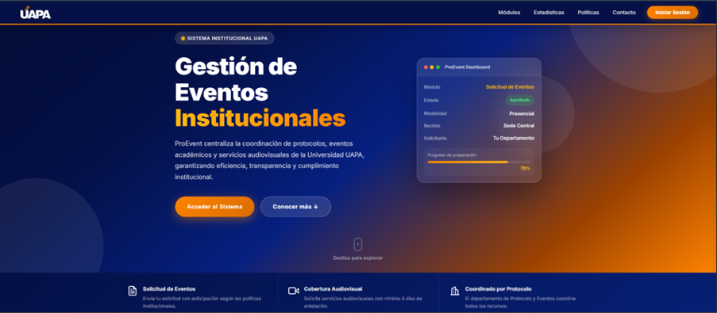

## Introducción

Este manual tiene como objetivo guiar al usuario en el uso del sistema de gestión de eventos, describiendo cada una de sus funcionalidades según el rol asignado. El sistema permite gestionar eventos, usuarios, solicitudes, presupuestos y recursos audiovisuales de manera eficiente.

---

## 1. Acceso al Sistema

### 1.1 Página de Inicio (Landing Page)
En la página principal el usuario puede visualizar las siguientes opciones:
*   **Inicio**: Muestra información general del sistema.
*   **Módulos**: Acceso a las diferentes funcionalidades según el tipo de usuario.
*   **Estadística**: Visualización de datos y reportes previos al registro.
*   **Política**: Información sobre normas y políticas de solicitud.
*   **Contacto**: Información para soporte y comunicación.

### 1.2 Módulos y Navegación
Al presionar la opción "Módulos" en el header principal, se despliegan las herramientas disponibles.

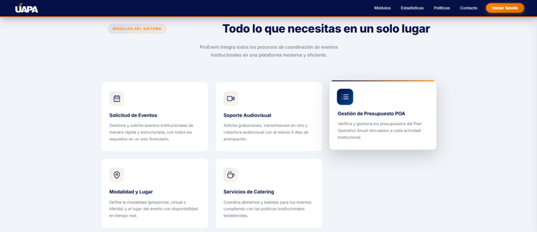

### 1.3 Inicio de Sesión (Login)
Acceso mediante credenciales (usuario y contraseña) para acceder a las funcionalidades correspondientes al rol.

### 1.4 Recuperación de Contraseña
Proceso para restablecer la contraseña en caso de olvido.

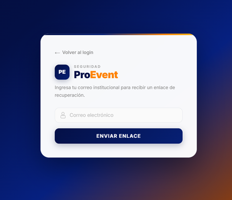

---

## 2. Rol: Administrador General

El Administrador General tiene control total sobre la plataforma, incluyendo la gestión de usuarios y la supervisión global de eventos.

### 2.1 Dashboard de Eventos
Visualización general de todos los eventos, notificaciones y resumen de actividad reciente.

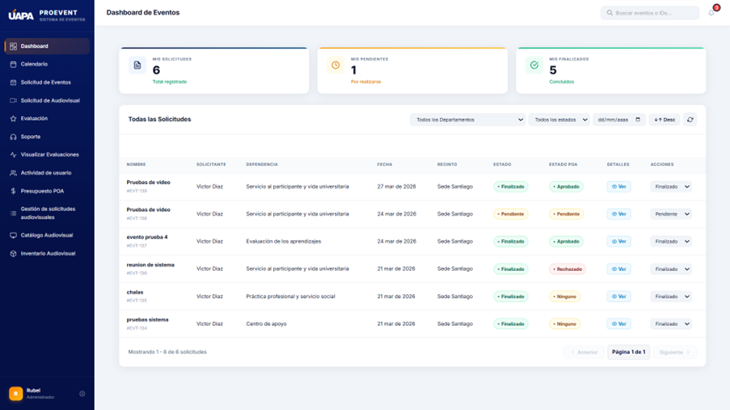

### 2.2 Gestión de Usuarios
Permite crear, editar o eliminar registros de usuarios en el sistema.

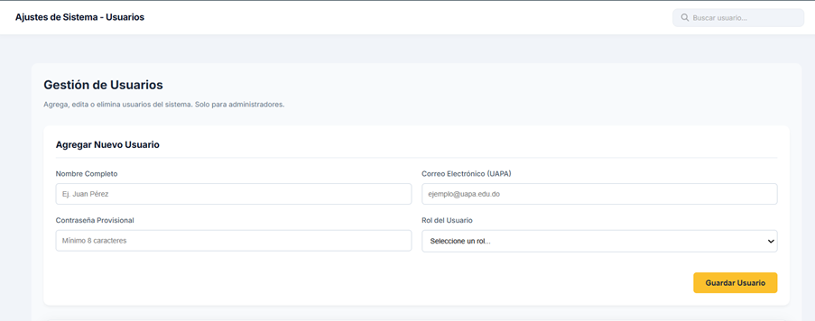
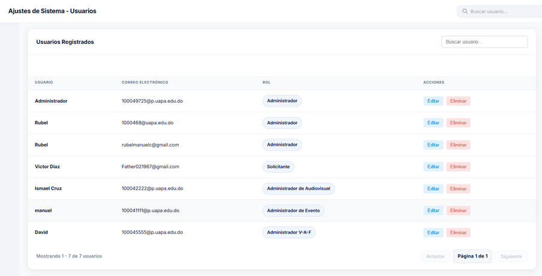

---

## 3. Rol: Solicitante

El Solicitante es el usuario que inicia los procesos de creación de eventos y recursos.

### 3.1 Dashboard y Seguimiento
Visualiza los eventos creados o en proceso, permitiendo dar seguimiento a las solicitudes.

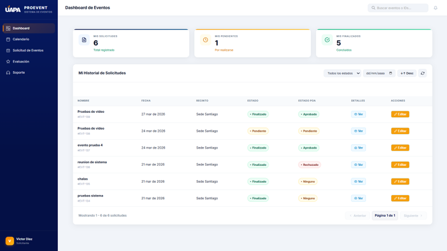

### 3.2 Calendario
Muestra los eventos organizados por fechas para facilitar la planificación.

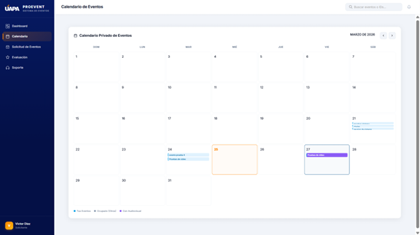

### 3.3 Solicitud de Evento (Pasos)
El proceso de solicitud se divide en:
1.  **Información General**: Datos básicos (nombre, fecha, ubicación).
2.  **Modalidad**: Presencial, Virtual o Híbrido.
3.  **Servicios**: Catering, Protocolo y detalles institucionales.
4.  **Presupuesto**: Estimación de costos.
5.  **Audiovisual**: Requerimientos técnicos.

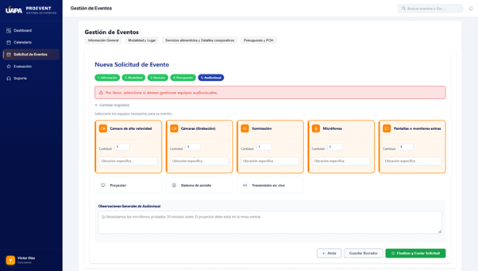
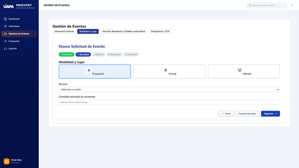

---

## 4. Rol: Administrador de Eventos

Encargado del mantenimiento del catálogo y la logística de los eventos aprobados.

### 4.1 Mantenimiento de Catálogo
Gestión de elementos relacionados con las solicitudes (espacios, servicios, etc.).

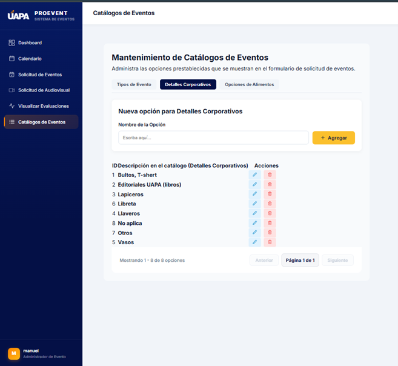

---

## 5. Rol: Administrador Audiovisual

Gestiona todos los recursos técnicos y equipos necesarios para los eventos.

### 5.1 Dashboard y Calendario Especializado
Los eventos con requerimientos audiovisuales aparecen resaltados (color morado) en el calendario.

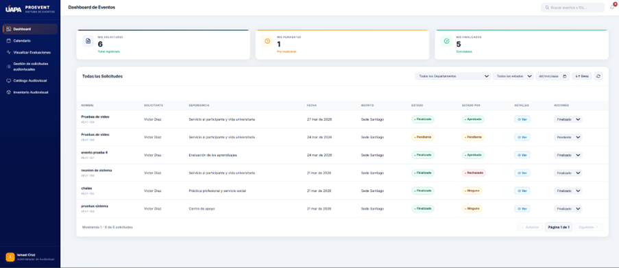

### 5.2 Gestión de Inventario
Control de disponibilidad de equipos y revisión de solicitudes técnicas.

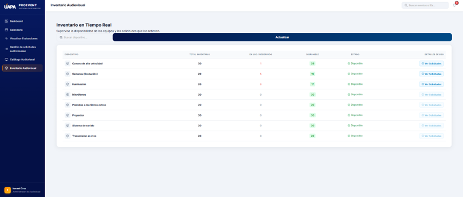

---

## 6. Conclusión

El sistema de gestión de eventos PROEVENT permite una administración integral de todos los procesos relacionados con la planificación, ejecución y evaluación de eventos en la UAPA. Cada rol garantiza la eficiencia y organización dentro de la plataforma.

---
**¡Gracias por usar PROEVENT!**

